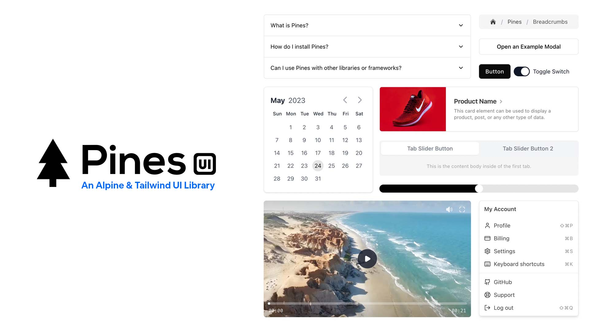

# Vue Pines UI Library



This is a WIP Vue.js port for the Open Source <a href="https://devdojo.com/pines" target="_blank">Pines UI Library</a>.

1. Download the contents of the GitHub repo and store it in a folder.
2. Make sure you have <a href="https://nodejs.org/" target="_blank">NodeJS</a> installed along with the <a href="https://www.npmjs.com/package/http-server" target="_blank">http-server</a> package.
3. CD into your folder and run `http-serve`
4. Visit the localhost URL to see PinesUI

Be sure to visit <a href="https://devdojo.com/questions" target="_blank">DevDojo discussions</a> section to ask questions and get assistance.

## License

The Pines UI Library is open-sourced software licensed under the [MIT license](https://opensource.org/licenses/MIT).

## Recommended IDE Setup

[VSCode](https://code.visualstudio.com/) + [Volar](https://marketplace.visualstudio.com/items?itemName=Vue.volar) (and disable Vetur).

## Type Support for `.vue` Imports in TS

TypeScript cannot handle type information for `.vue` imports by default, so we replace the `tsc` CLI with `vue-tsc` for type checking. In editors, we need [Volar](https://marketplace.visualstudio.com/items?itemName=Vue.volar) to make the TypeScript language service aware of `.vue` types.

## Customize configuration

See [Vite Configuration Reference](https://vite.dev/config/).

## Project Setup

```sh
npm install
```

### Compile and Hot-Reload for Development

```sh
npm run dev
```

### Type-Check, Compile and Minify for Production

```sh
npm run build
```

### Lint with [ESLint](https://eslint.org/)

```sh
npm run lint
```
